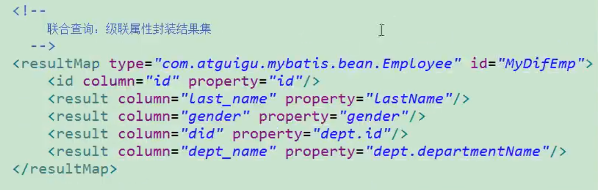
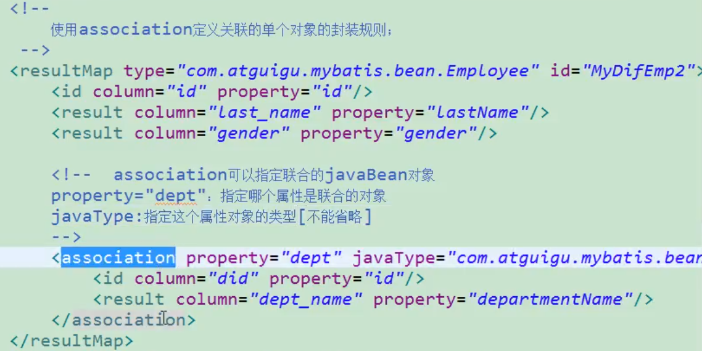
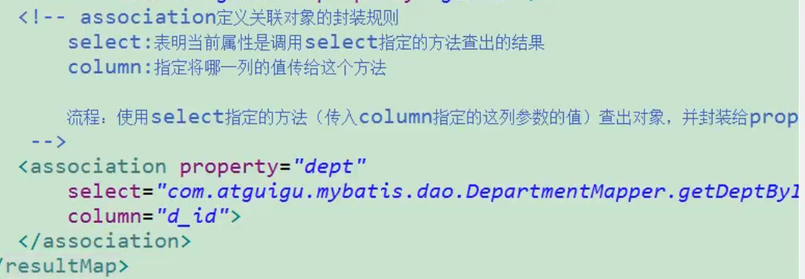
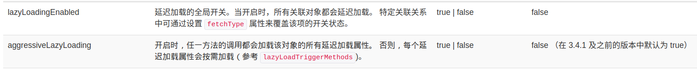
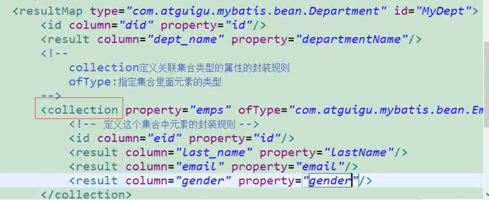
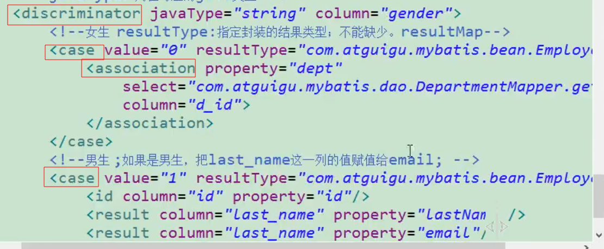

# 自定义结果映射规则

- 使用`<resultMap>`自定义某个javaBean的封装规则
  - `type`:自定义规则的java类型
  - `id`:规则的标识符
- 内部使用`<id>`定义主键，`<result>`定义普通列
  - `column`:指定列名
    - `property`:指定对应的javaBean属性

# 联合查询

1. 可以使用级联属性封装结果集

   - 一个javaBean的属性为另一个javaBean时，编写resultMap规则映射时可以直接用`Bean.Property`的方式赋值

   

2. 可以使用`<association>`标签定义单个对象的规则

   

# 分步查询

- 使用`<association>`标签内的`select`属性和`column`属性，分别传入已注册的select语句和参数

  

- `column`需要传递多个参数的话可以封装成Map的形式：`{key1=column1}`

  

# 延迟加载

- 在分步查询的基础上加上全局配置即可实现

  - `lazeLoadingEnabled`:true

  - `aggressiveLazyLoading`:false

    

- `fetchType`：该属性可存在与`<association>`和`<collection>`中，可以取

  - lazy：懒加载

  - eager：立即加载

    

# 关联集合属性的封装

- 使用`<collection>`标签指定`property`和`ofType`定义

  - `property`：指集合的名称
  - `ofType`：指集合内部的元素类型

  

- 使用`<collection>`也可以实现延迟加载，方法与上述一致

# discriminator（鉴别器）

- Mybatis可以使用Discriminator判断某列的值，根据该值改变封装行为

- 指定`column`（判定的列名）和`javaType`（列值对应的java类型）

- 使用`<case value="" resultType=""|resultMap="">`

  