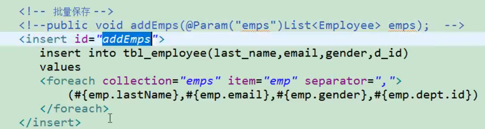
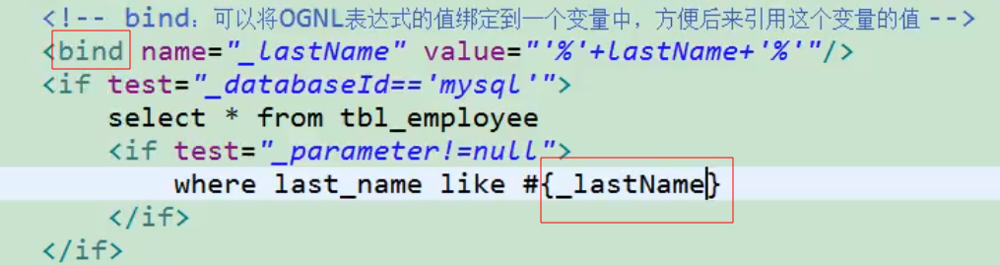

# if

- 使用`<if test="">`标签判断


## where（封装select）

- <if>内可以使用`<where>`解决某些条件没带的问题(and或or写在前面)

  ```xml
          select * from tbl_employees
          <where>
              <if test="id!=null">
                  id = #{id}
              </if>
              <if test="lastName!=null and lastName!=''">
                  and last_name like #{lastName}
              </if>
              <if test="email!=null and email.trim()!=''">
                  and email=#{email}
              </if>
              <if test="gender==0 or gender==1">
                  and gender=#{gender}
              </if>
          </where>
  
  ```


## set（封装update）

- 类似<where>自动去除各种多余字符


## trim

- 可以自定义字符串截取规则
- prefix/suffix : 设置前后缀
- prefixOverrides/suffixOverrides : 去除前后缀


# choose (when, otherwise)

- 类似switch-case语句

```xml
<where>
	<choose>
		<when test="">
    	</when>
        
        <when test="">
    	</when>
        
        <when test="">
    	</when>
        
        <otherwise>
        </otherwise>
	</choose>
</where>
```


# foreach

- 使用`<foreach collection="" item="" separator="" ...>`遍历集合中的元素拼接入SQL

- `collection` : 指定要遍历的集合：

  ​	list类型的参数会做特殊处理封装在map中，map的key就叫list

- `item`  : 将当前遍历出的元素赋值给指定对象

- `index` : 索引。遍历list的时候index就是``索引``，item就是当前值，

  ​						遍历map的时候index是`key`，item就是`value`

- `separator` : 指定分隔符

- `open` : 遍历出的`所有`结果前拼接一个开始的字符串

- `close` : 遍历出的`所有`结果后拼接一个开始的字符串


## 批量插入




# 两个内置参数

1. `_parameter` : 代表整个参数

   ​							单个参数：_parameter就是这个参数

   ​							多个参数：参数会被封装为一个Map，_parameter就是这个Map

2. `_databaseId` : 如果配置了databaseIdProvider，_databaseId就是当前数据库的别名


# bind

- 使用`<bind name="" value="">`可以将OGNL表达式的值绑定到一个变量中，方便后来引用




# sql

- 使用`<sql id="">`可以抽取可重用的字段方便后面引用
- 使用`<inclue refid=""></include>`
  - include内部还可以自定义`<property name="" value="">`，sql标签内部能使用自定义的属性（使用`${prop}`取值）
- 经常将要查询或插入的列名抽取出来方便引用