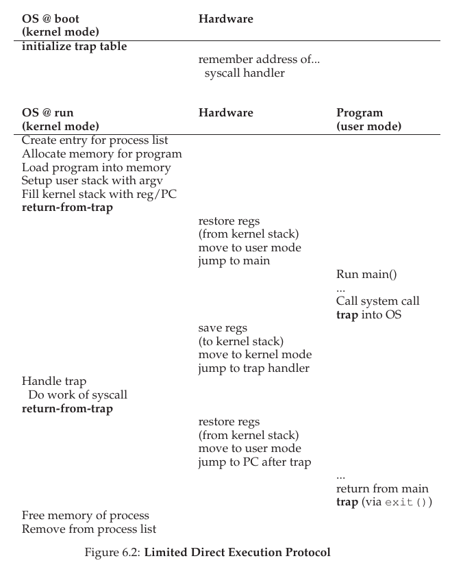
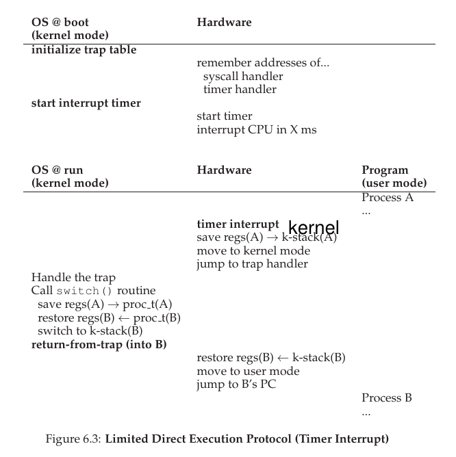

# 引入

- 我们需要让多个任务共享一个物理CPU

- 可以使用虚拟化机制满足需求，但产生了`性能`以及`控制`两个方面的问题

  

  > 如何高效、可控地虚拟化CPU？

- 使用`受限直接执行技术(Limited Direct Execution)`！

# 问题1

**操作系统怎么保证当前程序不做任何我们不希望做的事同时快速运行？**

- 引入`用户模式(user mode)`和`内核模式(kernel mode)`

  > user mode下运行的代码会受到限制
  >
  > kernel mode下可以执行特权(privileged)操作
  >
  > user mode执行特权操作：使用系统调用

- 提供了`陷入内核(trap)`和`陷阱返回(return-from-trap)`

  > 为执行系统调用，用户模式下的程序必须执行陷阱指令(trap)，进入内核模式；
  >
  > 执行完特权操作后，操作系统调用一个陷阱返回指令，返回用户模式；
  >
  >
  > 执行陷阱时，硬件必须确保存储调用者的寄存器，以便正确返回；

**追问：陷阱如何知道OS内运行哪些代码？**

- 发起调用的过程不能直接指定要跳转到的地址（保证安全）

> 内核通过在启动时设置陷阱表(trap table)来实现

# 问题2

**在运行一个进程时操作系统如何让它停下来并切换到另一个进程？**

> 如果一个进程在CPU上运行，则操作系统没有运行
>
> 如何让操作系统重获CPU的控制权？

- 协作方式：等待进程调用`yield`系统调用，或者应用程序执行了某些非法操作，控制就会转移到CPU
- 非协作方式：利用`时钟中断`定时的产生中断

## 保存和恢复上下文

进程切换时需要保存和恢复上下文

> 两种寄存器保存/恢复方式：
>
> 1. 硬件隐式保存到该进程的内核栈
> 2. 软件（OS）明确地保存到进程结构的内存中

