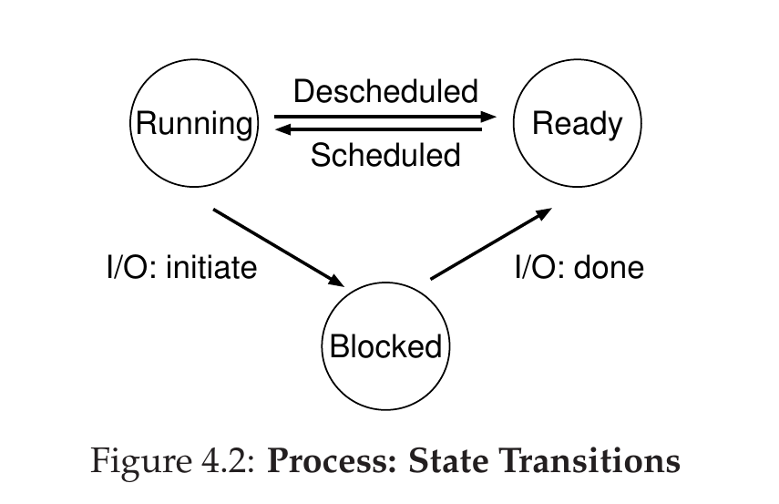

# 进程是什么？

- 简单来说，进程是操作系统为正在运行的程序提供的抽象
- 进程操作系统动态执行的基本单元（基本分配单元，基本执行单元）

# 进程的组成

- 程序
- 数据
- 进程控制块

# 进程的机器状态

- 内存（称为地址空间）
- 寄存器
  - 程序计数器(Program Counter)
  - 栈指针(Stack Pointer)
  - Frame Pointer

# 进程的创建

1. 申请一个空白PCB
2. 将代码和静态数据从disk中加载到memory
   - 早期操作系统的加载尽早(eagerly)完成
   - 现代操作系统的加载惰性(lazily)执行
3. 为程序运行时的栈(stack)分配内存，也为堆(heap)分配内存
4. 执行一些其他初始化任务，特别是I/O相关的任务
   - 初始化PCB，将系统分配的标识符以及父进程标识符填入PCB
   - 初始化状态信息：将PC指向程序的入口地址，SP指向栈顶
   - 初始化控制信息：将进程设置为就绪态
5. 将进程插入就绪队列中
6. 启动程序，跳转到main()，OS将CPU的控制权交给新创建的进程

# 进程的状态

- 运行(running)
- 就绪(ready)
- 阻塞(blocked)
- 初始(initial)
- 最终(final):在基于UNIX的系统中称为僵尸态

# 各种概念的区别

**程序**

程序是指令和数据的有序[集合](https://baike.baidu.com/item/集合)，其本身没有任何运行的含义，是一个``静态``的概念。而进程是程序在[处理机](https://baike.baidu.com/item/处理机)上的一次执行过程，它是一个``动态``的概念。

程序可以作为一种[软件](https://baike.baidu.com/item/软件)资料长期存在，而进程是有一定生命期的。程序是永久的，进程是暂时的。

进程更能真实地描述并发，而程序不能；

进程是由[进程控制块](https://baike.baidu.com/item/进程控制块)、[程序段](https://baike.baidu.com/item/程序段)、数据段三部分组成;

进程具有创建其他进程的功能，而程序没有。

同一程序同时运行于若干个数据集合上，它将属于若干个不同的进程，也就是说同一程序可以对应多个进程。

在传统的[操作系统](https://baike.baidu.com/item/操作系统)中，程序并不能独立运行，作为资源分配和独立运行的[基本单元](https://baike.baidu.com/item/基本单元)都是进程。

**线程**

通常在一个进程中可以包含若干个[线程](https://baike.baidu.com/item/线程)，它们可以利用进程所拥有的资源，在引入[线程](https://baike.baidu.com/item/线程)的[操作系统](https://baike.baidu.com/item/操作系统)中，通常都是把进程作为分配资源的基本单位，而把线程作为独立运行和独立调度的基本单位，由于[线程](https://baike.baidu.com/item/线程)比进程更小，基本上不拥有[系统资源](https://baike.baidu.com/item/系统资源)，故对它的调度所付出的开销就会小得多，能更高效的提高系统内多个程序间并发执行的程度。

当下推出的[通用操作系统](https://baike.baidu.com/item/通用操作系统)都引入了[线程](https://baike.baidu.com/item/线程)，以便进一步提高系统的并发性，并把它视为[现代操作系统](https://baike.baidu.com/item/现代操作系统)的一个重要指标。