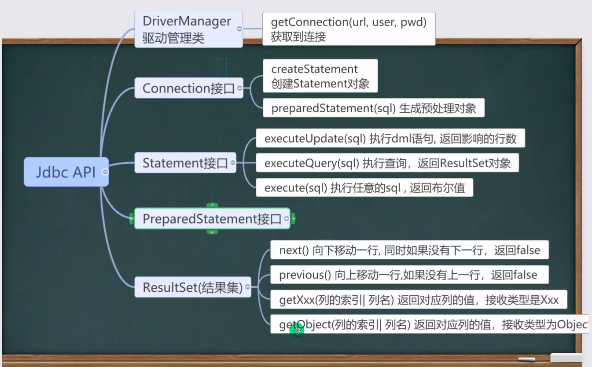
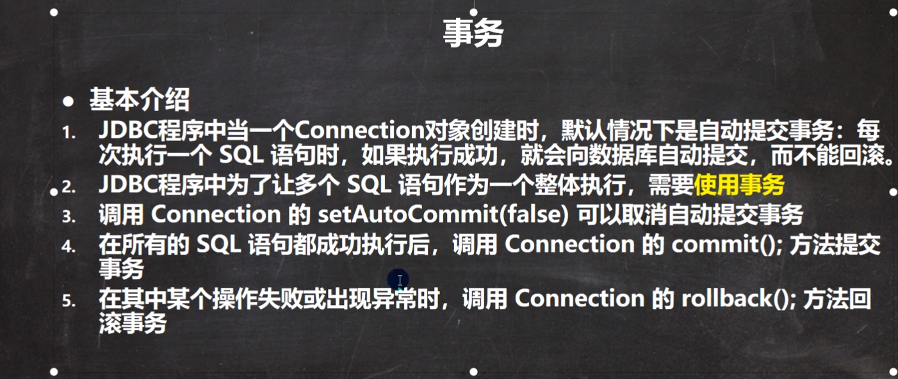
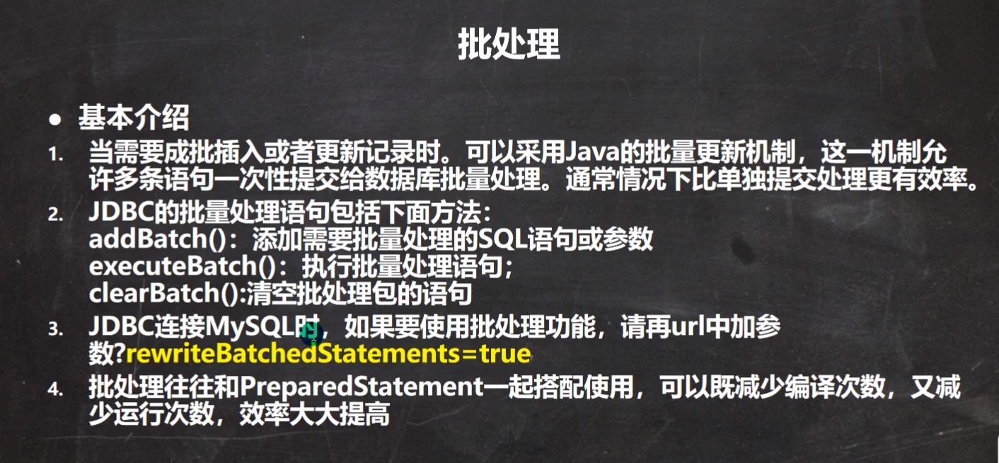
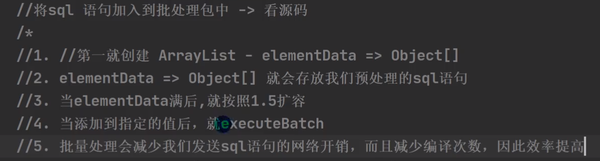
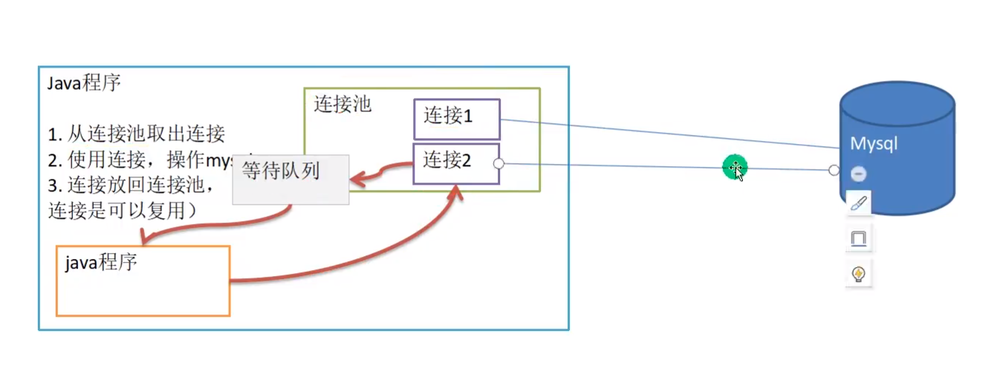

# 基本介绍

1. JDBC为访问不同的数据库提供了统一的接口，为使用者屏蔽了细节问题
2. Java程序员使用JDBC，可以连接任何提供了JDBC驱动程序的数据库系统，从而完成对数据库的各种操作


# 使用

1. 注册驱动
   - `Driver类`注册驱动
2. 得到连接
   - `Connection类`得到连接
3. 执行sql
   - `Statement类`用于执行sql
4. 关闭连接资源
   - 对`Connection`、`Statement`执行`close()`


example:

```java
    public static void main(String[] args) throws SQLException {
        //注册驱动
        Driver driver = new Driver();
        //得到连接
        String url = "jdbc:mysql://localhost:3306/S_T";
        Properties properties = new Properties();
        properties.setProperty("user","root");
        properties.setProperty("password","010408");
        Connection connect = driver.connect(url,properties);

        //执行sql
        String sql = "insert into student values('789','bb','n',23,'EE')";
        Statement statement = connect.createStatement();
        int rows = statement.executeUpdate(sql);    //返回受影响的行数

        System.out.println((rows>=1?"success!":"fail"));

        //关闭连接
        statement.close();
        connect.close();
    }
```


# 获取数据库连接的五种方式

1. new 一个 Driver ，用 Driver 的connect(url,properties)获取连接

2. 使用反射动态加载 Driver

3. 使用DriverMannager统一管理

4. 使用Class.forName自动完成注册驱动

5. 连接信息写到.properties文件，优化4

   ```java
           Properties properties = new Properties();
           properties.load(new FileInputStream("src/main/java/com/JDBC/connect/db.properties"));
   
           String driver = properties.getProperty("driver");
           String user = properties.getProperty("user");
           String password = properties.getProperty("password");
           String url = properties.getProperty("url");
   
           Class.forName(driver);
           Connection connection = DriverManager.getConnection(url,user,password);
   ```


# ResultSet结果集

- 表示数据库结果集的数据表，通常通过执行查询数据库语句生成
- ResultSet对象保持一个光标指向其当前的数据行，最初光标位于第一行之前
- 可以通过next方法使得next向下移一行，并在ResultSet没有更多行时返回false，因此可以在while循环中使用其遍历结果集


# Statement

- 用于执行静态SQL语句并返回其生成的结果的对象
- 连接建立后，需要对数据库进行访问，执行命名或是SQL语句，可以通过
  - Statement[存在SQL注入]
  - PreparedStatement[预处理]
  - CallableStatement[存储过程]


## SQL注入


# PreparedStatement

**好处**：

1. 不再使用+拼接SQL语句，减少语法错误
2. 避免SQL注入
3. 大大减少编译次数，效率较高


## 连接数据库

1. 使用Connection的prepareStatement(String sql)获得PreparedStatement对象
   - sql中可以使用``?``占位，在PreparedStatement中使用setString()方法填充


# 连接的总结




# 事务




# 批处理



## 源代码

## 


# 数据库连接池

## 传统JDBC的弊端

1. 每次建立连接都必须将Connection加载到内存中，再验证IP地址、用户名、密码。需要一个连接，就向数据库请求一次的情况会产生频繁的请求，容易使得数据库崩溃。
2. 每一次数据库连接，都必须将其关闭，如果程序发生异常没有及时将连接关闭，会产生内存泄露的问题
3. 传统的连接方式不能控制数据库的连接数量


- 可以采取数据库连接池的技术解决上述问题


## 数据库连接池的原理

### 基本介绍

1. 预先在数据库连接池中放入一定数量的连接，当程序需要使用就在其中取出，使用完将其放回连接池
2. 数据库连接池负责分配、管理和释放数据库连接，它允许程序重复使用一个现有的连接，而不是重新建立一个
3. 当数据库连接池中可用连接数量不足，请求会被放入等待队列




### 种类

1. JDBC的数据库连接池通常使用javax.sql.DataSource来表示，DataSource是一个接口，通常由第三方来提供实现
2. C3P0：速度相对较慢，稳定性不错（Spring，hibernate）
3. Druid（德鲁伊）
4. BoneCP
5. HikariCP
