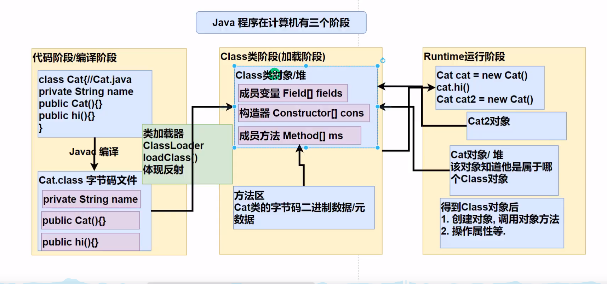
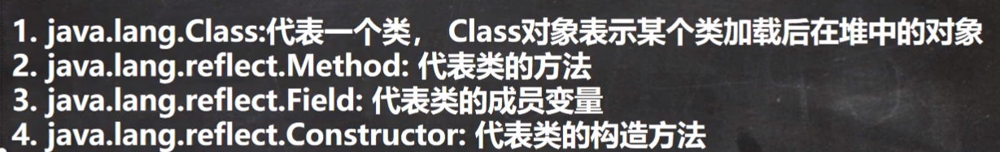
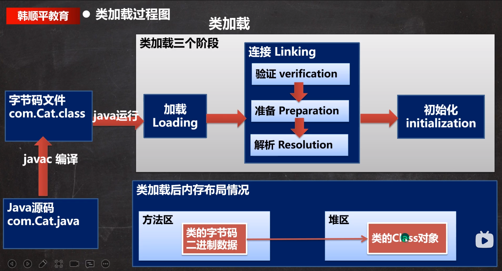

# 反射

- 允许程序在执行期间通过`Reflection`API取得任何类的内部信息，并能操作对象的属性和方法
- 实现了开闭原则
- 加载完类之后，在堆中就产生一个Class类型的对象（一个类只有一个Class对象），这个对象包含了该类的完整结构信息。通过这个对象可以得到类的结构。
- 使用反射基本是解释执行，对执行速度有影响
- Java实现动态语言的关键

## 反射相关的主要类

**reflect下共有方法**

- `getName()`方法，用来返回项目的名称
- `getModifiers()`方法，返回一个整形数值，用不同的位开关描述修饰符的使用状况
- `setAccessible()`覆盖访问控制，使得反射可以访问私有域内容(accessible -> 无障碍的)
  - 取消访问检查后可以提升一些反射的性能

### 1.Class(实际上是一个泛型类)

- Class类对象不是new出来的，而是系统创建的
- 对于某个类的`Class对象`，内存中只会存在一份，因为类只加载一次
- 每个类的实例都会记录自己是由哪个Class实例生成的
- Class对象是存放在`堆（heap）`上

#### 获取方法

1. Object类中的`getClass()`方法
   - 
2. 调用Class类的静态方法`forName(String className)`
   - 多用于配置文件，读取类的全路径，加载类
3. 如果T是任意的Java类型（包括基本数据类型），`T.class`将代表匹配的类对象
   - 多用于参数传递，最为安全可靠，程序性能最高
4. 通过类加载器(ClassLoader)【有四种】的`loadClass()`获取
5. 基本数据类型对应的包装类可以通过`.TYPE`获取

#### 可调用方法

- `getName()`返回类的名字
- `newInstance()`动态地创建一个类的实例（如果类的构造器要求提供参数，则应该调用`Constructor`中的`newInstance()`方法）
- `getPackage()`获取包名
- 

- 返回类提供的public域、public方法和构造器数组

1. `getFields()`
2. `getMethods()`    //包括父类方法
3. `getConstructors()`

- 返回类中声明的全部域、方法和构造器

  1. `getDeclaredFields()`
  2. `getDeclaredMethods()`    //不包含父类方法
  3. `getDeclaredConstructors()`

- 返回具体的域、方法和构造器

1. `getField(String name)`
2. `getMethods(String name, Class<?>... parameterTypes)`
3. `getConstructor(Class<?>... parameterTypes)`

### 2.Method

1. `invoke(Object obj,Object...args)`第一个参数是隐式参数，其余的对象提供了显式参数，该方法可以调用包装在当前Method对象中的方法

### 3. Field

1. `getType()`    返回描述域所属类型的`Class`对象
2. ` Object get(Object obj)`obj是包含域的类的某个对象，对于基本数据类型会自动装箱
3. `set(obj,value)`可以将obj对象的f域设置成新值

### 4.Constructor

---

## 类加载

### 静态加载

- 编译时加载相关的类，如果没有则报错，依赖性很强

### 动态加载

- 运行时加载类，如果运行时不用该类，则不报错，降低了依赖性

### 类加载的时机

1. 当创建对象时（new） //静态加载
2. 当子类被加载时，父类也加载    //静态加载
3. 调用类中的成员    //静态加载
4. 通过反射    //动态加载

- 加载

  - 将字节码从不同的数据源转化为二进制字节流加载到内存中，并为之创建一个java.lang.Class对象。此过程由类加载器完成

  

- 连接：将类的二进制数据合并到JRE中

  - 验证：对安全进行校验
    - 目的是为了确保Class文件的字节流中包含的信息符合当前虚拟机的要求，并且不会危害虚拟机自身的安全
  - 准备：对静态变量分配内存并默认初始化，这些变量使用的内存将在方法区中进行分配
    - 非静态变量不会分配内存，静态变量会分配内存并赋一个对应的默认值，常量会直接赋值
  - 解析：虚拟机将常量池内的符号引用（相对地址）转成直接引用（直接地址）

- 初始化：执行在类中定义的代码，执行`<clinit>()`方法的过程
  - `<clinit>()`方法是由编译器按语句在源文件中出现的次序 ，依次自动收集类中所有静态变量赋值动作和静态代码块中的语句，并进行合并。
  - 虚拟机会保证一个类的`<clinit>()`方法在多线程环境中被正确地加锁、同步，如果多个线程同时加载一个类，那么只有一个线程会去执行该类的`<clinit>()`方法，其他线程会被阻塞，直到活动线程执行完毕。

---

