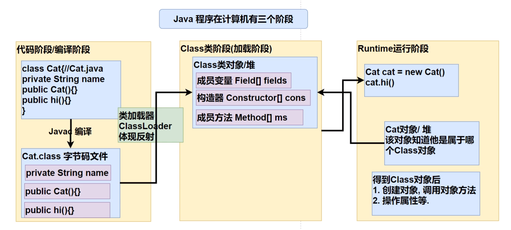

# 反射

- 允许程序在执行期间通过`Reflection`API取得任何类的内部信息，并能操作对象的属性和方法
- 实现了开闭原则
- 加载完类之后，在堆中就产生一个Class类型的对象（一个类只有一个Class对象），这个对象包含了该类的完整结构信息。通过这个对象可以得到类的结构。
- 使用反射基本是解释执行，对执行速度有影响

## 反射相关的主要类

**reflect下共有方法**

- `getName()`方法，用来返回项目的名称
- `getModifiers()`方法，返回一个整形数值，用不同的位开关描述修饰符的使用状况
- `setAccessible()`覆盖访问控制，使得反射可以访问私有域内容(accessible -> 无障碍的)
  - 取消访问检查后可以提升一些反射的性能

### 1.Class(实际上是一个泛型类)

#### 获取方法

1. Object类中的`getClass()`方法
2. 调用Class类的静态方法`forName(String className)`
3. 如果T是任意的Java类型（包括基本数据类型），`T.class`将代表匹配的类对象

#### 可调用方法

- `getName()`返回类的名字
- `newInstance()`动态地创建一个类的实例（如果类的构造器要求提供参数，则应该调用`Constructor`中的`newInstance()`方法）

- 返回类提供的public域、public方法和构造器数组

1. `getFields()`
2. `getMethods()`    //包括父类方法
3. `getConstructors()`

- 返回类中声明的全部域、方法和构造器

  1. `getDeclaredFields()`
  2. `getDeclaredMethods()`    //不包含父类方法
  3. `getDeclaredConstructors()`

- 返回具体的域、方法和构造器

1. `getField(String name)`
2. `getMethods(String name, Class<?>... parameterTypes)`
3. `getConstructor(Class<?>... parameterTypes)`

### 2.Method

1. `invoke(Object obj,Object...args)`第一个参数是隐式参数，其余的对象提供了显式参数，该方法可以调用包装在当前Method对象中的方法

### 3. Field

1. `getType()`    返回描述域所属类型的`Class`对象
2. ` Object get(Object obj)`obj是包含域的类的某个对象，对于基本数据类型会自动装箱
3. `set(obj,value)`可以将obj对象的f域设置成新值

### 4.Constructor

