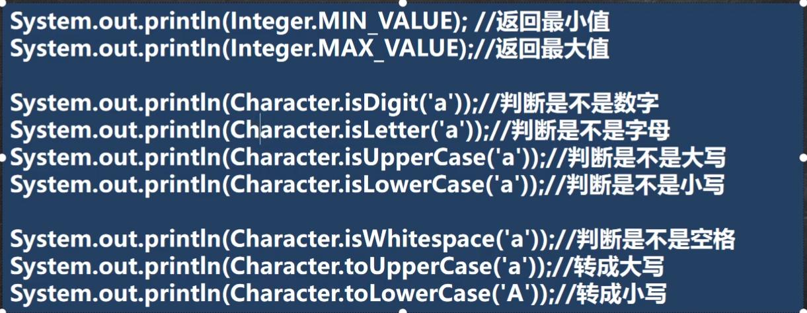
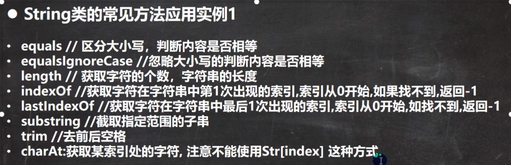
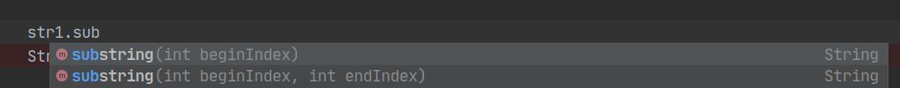
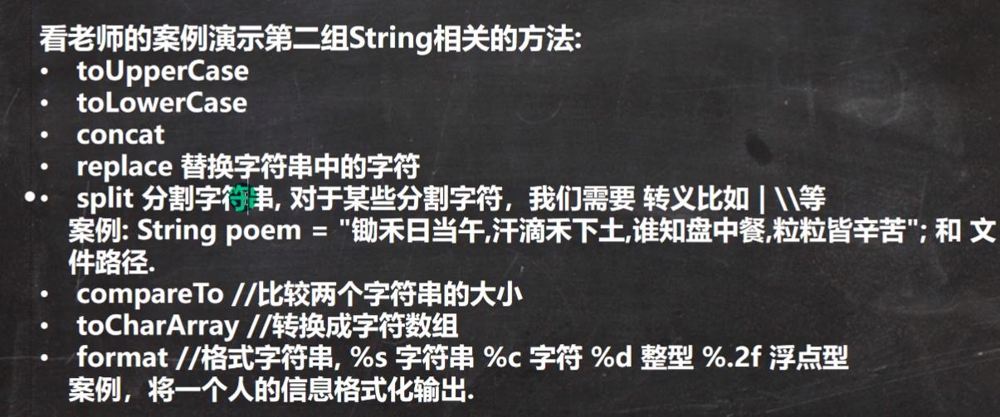
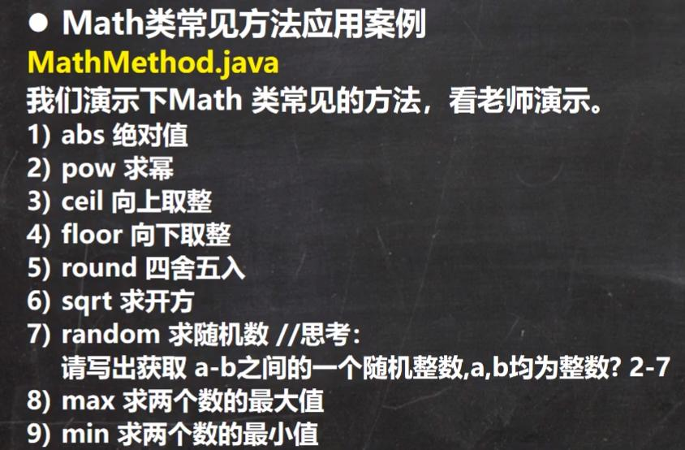

# 常用类

---


## 包装类(wrapper)

- 对于Integer类，类加载时已经初始化-128～128的值在IntegerCache数组

  

| 基本类型 | 包装类    | 父类           | 实现接口                                     |
| -------- | --------- | -------------- | -------------------------------------------- |
| boolean  | Boolean   | Object         | Serializable/Comparable(可序列化的/可比较的) |
| char     | Character | Object         |                                              |
| byte     | Byte      | Number->Object |                                              |
| int      | Integer   | Number->Object |                                              |
| long     | Long      | Number->Object |                                              |
| short    | Short     | Number->Object |                                              |
| float    | Float     | Number->Object |                                              |
| double   | Double    | Number->Object |                                              |


### 装箱和拆箱

- jdk5以前手动装箱和拆箱

  ```java
  int n1 = 100;
  Integer i1 = new Integer(n1);//手动装箱方法1
  Integer i2 = Integer.valueOf(n1);//手动装箱方法2
  int n2 = i1.intValue();//手动拆箱
  ```

  

- jdk5以后自动装箱和拆箱

  ```java
  int n1 = 100;
  Integer i1 = n1;//自动装箱(底层使用valueOf())
  int n2 = i1;//自动拆箱(底层使用intValue())
  ```

  

- 自动装箱底层调用`valueOf()`方法

- 自动拆箱底层调用`intValue()`方法


### 转换

- wrapper -> String

  ```java
  Integer i = 100;
  //1.
  String str1 = i+"";
  //2.
  String str2 = i.toString();
  //3.
  String str2 = String.valueOf(i);
  ```

   

- String -> wrapper

  ```java
  String str = "234";
  //1.
  Integer i1 = Integer.parseInt(str);
  //2.
  Integer i2 = new Integer(str);
  ```


### 常用方法



---

## String类

- 实现了Serializable接口，可以串行化，实现网络传输
- 实现了Comparable接口，可以比较
- 使用Unicode编码，一个字符占两个字节
- 有属性 private final char value[];用于存储字符串内容
- intern()方法返回一个池中的字符串
- 常量相加在池，变量相加在堆（调用StringBuilder))
- String类的“+”操作底层是创建一个StringBuilder

```java
//example
String s1 = "hello"+"java";
//1. StringBuilder sb = new StringBuilder();
//2. sb.append("hello");
//3. sb.append("java");	
//4. return sb.toString();
```


### 常用方法





- substring()中，截取的字符串包括beginIndex，不包括endIndex




- concat()用于连接字符串


## StringBuffer类

- 代表可变长度的字符序列，可以对字符串的内容进行增删
- 很多方法与String相同，但StringBuffer是可变长度的
- StringBuffer是一个容器
- 直接父类是AbstractStringBuilder，有一个属性char[] value，不是final
- 上述value存放字符串内容，不是final，因此在堆中
- 修改时效率比String高，因为不需要每次重新创建新对象


### 构造器

- 默认构造器创建一个大小为16的数组
- 可以指定创建数组的大小
- 输入一个String参数大小为参数大小+16

### 转换

String -> StringBuffer

1. 使用StringBuffer构造器
2. 使用append()方法

StringBuffer -> String

1. 使用toString()方法
2. 使用String构造器


### 常用方法

1. append()
2. delete(int start,int end)     `[Start,end)`
3. replace(int start,int end,String str)    `[Start,end)`
4. indextOf(String str)    返回字符串第一次出现的位置
5. insert(int offset,String str)    在索引为offset的位置插入str，原来索引为offset的内容自动后移


## StringBuilder

- StringBuffer类的替换，与StringBuffer兼容
- StringBuilder不保证同步，是线程不安全的
- StringBuilder比StringBuffer效率高，用在`字符串缓冲区被单个线程使用`的情况


## 对比

- String：不可变字符序列，效率低，复用率高
- StringBuffer：可变字符序列，效率较高（增删），线程安全
- StringBuilder：可变字符序列，效率最高（增删），线程不安全

- 在字符串被少量修改，被多个对象引用的情况下用String
- 在字符串被大量修改，且在单线程的情况下用StringBuilder
- 在字符串被大量修改，且在多线程的情况下用StringBuffer

---

## Math



---

## Array

### 常用方法

1. sort()
2. binarySearch()    必须在已排序的数组中使用
3. copyOf(Arr[],int length)    从Arr[]中拷贝length个元素到另一个数组
   - 如果拷贝长度比数组长度长，后面添加null
   - 如果拷贝长度为负数，抛异常
4. fill(Arr[],int n)    使用n替换Arr中全部元素
5. equals()     比较数组
6. asList()    将数组转化为List

---

##　System类

1. exit()    退出当前程序
2. arraycopy()    复制数组元素，比较适合底层调用
3. currentTimeMilens(src,srcPos,dest,destPos,length)    返回当前时间距离1970-1-1的毫秒数
4. gc()    运行垃圾回收机制

---

## 大数

### BigInteger

- 该类表示一个不会有范围限制的整数，但处理速度较慢
- 继承自Number类
- 可以使用`longValue()`转换为基本类型，但转换时会丢失高位信息，即结果不一定准确
- 可以使用`longValueExact`准确转换为基本类型，但转换时如果超出范围，**将抛出**`ArithmeticException`异常。
- 加减乘除运算时只能使用方法


### BigDecimal

- 该类表示一个任意大小且精度完全准确的浮点数
- 用scale()表示小数位数，返回负数表示是一个整数，并且末尾有0
- 通过`BigDecimal`的`stripTrailingZeros()`方法，可以将一个`BigDecimal`格式化为一个相等的，但去掉了末尾0的`BigDecimal`
- 做加减乘精度不会丢失
- 做除法时要指定精度（保留分子精度可指定BigDecimal.ROUND_CEILING)

---

## 日期

### 第一代日期类

- Date：精确到毫秒，表示特定瞬间

- SimpleDateFormat：格式化和解析日期的类

  > - yyyy：年
  > - MM：月
  > - dd: 日
  > - HH: 小时
  > - mm: 分钟
  > - ss: 秒


### 第二代日期类（Calendar类）

- Calendar类（日历）是一个抽象类，构造器是私有的
- 只有一种方式获取实例，即`Calendar.getInstance()`，而且一获取到就是当前时间
- 使用get()获取属性
- 使用set()改变
- 没有提供对应的格式化的类


### 第三代日期类 （jdk8加入）

- 前两代日期类的不足，Date大部分方法在引入Calendar后弃用，而Calendar有几个不足
  1. 可变性：日期应该是不可变的
  2. 偏移性：Date中的年份从1900开始，而月份从0开始
  3. 格式化：格式化只对Date有用，对Calendar无效
  4. 线程不安全；不能处理闰秒
- LocalDate（日期）、LocalTime（时间）、LocalDateTime（日期时间）
  - LocalDate只包含日期，可以获取日期字段
  - LocalTime只包含时间，可以获取时间字段
  - LocalDateTime包含日期和时间，可以获取日期和时间字段

方法：

1. now()    返回当前日期时间对象
2. get...()    获取想要的信息


- 使用`DateTimeFormatter`对象来格式化
- `Instant`时间戳   类似Date，两者可以相互转换（Date.from()/date.toInstant()）

