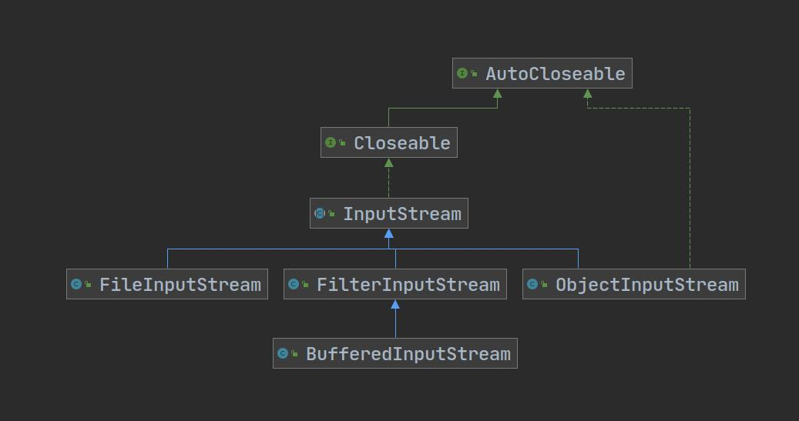

# 流

## 文件

- 存放数据的地方

- 文件在程序中是以流的方式传递的

**文件对象File**

- 实现了Serializable接口（可串行化）和Comparable接口（可比较）

**创建文件的相关构造器和方法**

- new File(String pathName)
- new File(File parent,String child)    //根据父目录文件+子路径创建
- new File(String parent,String child)    //根据父目录+子路径创建

- createNewFile()    //创建新文件

### 常用方法

- getName()
- getAbsolutePath()     //绝对路径
- getParent()    //父级目录
- length()    //文件大小（按字节）
- exists()    //文件是否存在
- isFile()    //是不是文件
- isDirectory()    //是不是目录

### 目录

- mkdir()     //创建目录
- mkdirs()    //创建多级目录
- delete()    //删除文件或目录（只能删除空目录）

## IO流

分类

1. 按操作单位：字节流（8bit）    二进制文件、字符流    文件
2. 按流向：输入流、输出流
3. 按流的角色：结点流、处理流\包装流

| 抽象基类 | 字节流       | 字符流 |
| -------- | ------------ | ------ |
| 输入流   | InputStream  | Reader |
| 输出流   | OutputStream | Writer |

### FileStream

**关系图**

#### FileInputStream

1. read()    //每次读取一个字节，读到文件末尾返回-1
2. read(byte[] b)    //每次读取最多b.length的数据到字节数组，读取正常，返回实际读取的字节数，读到文件末尾返回-1

#### FileOutputStream

- 构造器new FileOutputStream(String filePath,boolean append)
  - append为true则写入将追加到文件末尾

1. write(int b)    //将一个字节数据写到文件中，如果文件不存在，则创建文件（目录必须存在）
2. write(byte[] b)    //将字节数组写到文件中，如果文件不存在，则创建文件（目录必须存在）
   - 配合String中的getBytes()方法将字符串写入文件
3. write(byte[] b，int off,int len)    //将字节数组索引off到索引len写到文件中，如果文件不存在，则创建文件（目录必须存在）

#### FileReader

- new FileReader(File/String)

1. read()    //每次读取一个字符，读到文件末尾返回-1
2. read(char[] c)    //每次读取最多c.length的数据到字符数组，读取正常，返回实际读取的字节数，读到文件末尾返回-1

#### FileWriter

- 构造器new FileWriter(File/String,boolean append)
  - append为true则写入将追加到文件末尾

1. write(int b)    //将一个字符数据写到文件中，如果文件不存在，则创建文件（目录必须存在）
2. write(char[] c)    //将字符数组写到文件中，如果文件不存在，则创建文件（目录必须存在）
   - 配合String中的toCharArray()方法将字符串写入文件
3. write(char[] c，int off,int len)    //将字符数组索引off到索引len写到文件中，如果文件不存在，则创建文件（目录必须存在）
4. write(String)    //写入整个字符串
5. write(String ,off ,len)    //写入字符串的指定部分

- FileWriter使用后，必须close或flush，否则写入不到指定文件（底层还是FileOutputStream)

---

### 节点流和处理流

**节点流**： 可以从一个特定的数据源读写数据，如FileReader、FilerWriter

**处理流**： 也叫“包装流”，是“连接“在已存在的流之上，为程序提供更为强大的读写功能，如BufferedReader、BufferedWriter

- 处理流对节点流进行了包装，使用了修饰器的设计模式，不会直接与数据流相连
- 处理流提高了性能
- 处理流操作更加便捷

---

## bufferedStream

- close()时只需要关闭外层流

### BufferedReader

- readLine()    //读出文件的一行数据

### BufferedWriter

- 需要追加的方式写入时，传入一个以追加的方式打开的节点流

- writer()    //写入文件
- newLine()    //插入一个跟系统相关的换行符

### BufferedInputStream

- 继承了FilterInputStream,有一个InputStream成员变量接收节点流

### BufferedOutputStream

- 继承了FIlterOutputStream，有一个OutputStream成员变量接收节点流

---

##　对象流

- 满足保存数据的值和数据类型的需求（序列化）
- 满足将数据的值和数据类型恢复到程序中的需求（反序列化）
- 需要让某个对象支持序列化机制，则必须让其类是可序列化的，为了让某个类是可序列化的，该类必须实现如下两个接口之一：
  1. Serializable    //这是一个标记接口，里面没有任何方法
  2. Externalizable    //该接口有方法需要实现，因此我们一般实现上面的接口

### ObjectInputStream

- 一个处理流

### ObjectOutputStream

- 一个处理流
- 读取（反序列化）的顺序需要和你保存数据（序列化）的顺序一致，否则会报异常
- 反序列化后得到一个类，要想使用该类，必须`向下转型`并且保证该类的定义可以访问

### 使用细节

1. 读写顺序要一致
2. 要求序列化或反序列化对象，需要实现`Serializable`接口
3. 序列化的类中建议添加`SerialVersionUID`，为了提高版本的兼容性
4. 序列化对象时，默认将里面所有属性都进行序列化，除了`static`或`transient`修饰的成员
5. 序列化对象时，要求里面属性的类型也要实现`Serializable`
6. 序列化具有继承性，已经序列化的类的所有子类默认实现了序列化

---

## 标准输入输出流

|            | 编译类型    | 运行类型            | 默认设备 |
| ---------- | ----------- | ------------------- | -------- |
| System.in  | InputStream | BufferedInputStream | 键盘     |
| System.out | PrintStream | PrintStream         | 屏幕     |

---

## 转换流

- 可以指定编码方式（UTF-8、GBK...)

### InputStreamReader

- Reader的子类，可以将InputStream（字节流）包装（转换）成Reader（字符流）

### OutputStreamWriter

- Writer的子类，可以将OutputStream（字节流）包装（转换）成Writer（字符流）

---

## Print流

### PrintStream

- PrintStream(OutputStream)

- print(String)    //输出流，底层是write(byte[])
- write(byte[])
- System.setOut(new PrintStream(String path))    //将输出位置修改到path    

### PrintWriter

- PrintWriter(Writer)

- print()     //输出流

---

## Properties类

- 继承自Hashtable

- 专门用于读写配置文件的集合类

  - 格式：

    键=值

    键=值

  - 键值对不需要有空格，值不需要用引号，默认类型是String

### 常用方法

- load：加载配置文件的键值对到Properties对象
- list：将数据显示到指定设备
- getProperty(key)：根据键获取值
- setProperty(key,value)：设置键值对到Properties对象
- store：将Properties中的键值对存储到配置文件，在idea中，保存信息到配置文件，如果含有中文，会存储为unicode

