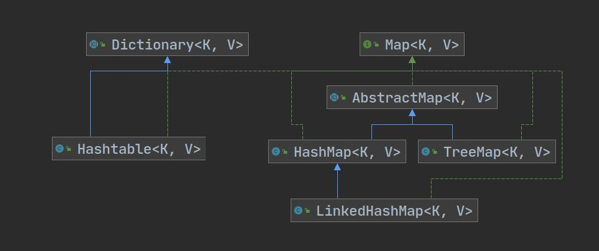

# 集合

- 可以动态保存多个对象，使用方便
- 提供了一系列方便操作对象的方法：add、remove、set、get等

---


## 体系图

**Collection**(单列集合)


**Map**（双列集合）




---


## Collection接口

- 没有直接实现的子类，是通过它的子接口List和Set实现


### 常用方法

1. add    添加单个元素
2. remove    删除指定元素（参数可以为index/Object）
3. contains    查找元素是否存在
4. size     获取元素个数
5. isEmpty    判断是否为空
6. clear    清空
7. addAll    添加多个元素
8. containsAll    查找多个元素
9. removeAll    删除多个元素

----

## List接口

- List接口存储元素是有序的（即添加顺序和存出顺序一致）、且元素可重复
- List每个元素都有对应的顺序索引，可以用索引取出元素（get()）

**方法**

1. add(int index,Object obj)     可以在指定位置插入

2. set(int index,Object obj)     将index处的元素变为obj，相当于是替换，只能替换已存在元素

3. subList(int fromIndex,int toIndex)    返回从fromIndex到toIndex位置的子集合

   

   ### 1.ArrayList类

- add()可以加入null
- 底层是由数组实现数据存储
- 基本等同与Vector，但ArrayList是线程不安全的（执行效率高）


#### 		底层和源码

- 维护了一个Object类型的数组`elementData`

> transient Object[] elementData;//transient 短暂的 表示该属性不会被序列化

- 创建ArrayList对象时，如果使用无参构造器，则初始`elementData`容量为0，第一次添加，则扩容`elementData`的大小为`10`，如需再次扩容，则扩容为`elementData`的1.5倍

- 如果使用了指定大小的构造器，则初始化`elementData`容量为指定大小，如果需要扩容，则直接扩容`elementData`为1.5倍

- 扩容时底层仍然是Arrays.copyOf(elementData,newCapacity);

- 扩容流程：add() -> ensureCapacityInternal(int minCapacity)//有一个判断elementData是否为空的过程

  ->ensureExplicitCapacity(int minCapacity)//判断是否需要扩容->grow(int minCapacity)//扩容函数

```java
//扩容重点源代码
int newCapacity = oldCapacity+(oldCapacity >> 1);
```


### 	2.Vector类

- 底层是数组
- 是线程安全的
- 与ArrayList类类似


#### 	底层和源码

- 维护了一个Object类型的数组`elementData`

> transient Object[] elementData;//transient 短暂的 表示该属性不会被序列化

- 创建ArrayList对象时，如果使用无参构造器，则初始`elementData`容量为0，第一次添加，则扩容`elementData`的大小为`10`，如需再次扩容，则扩容为`elementData`的2倍
- 如果使用了指定大小的构造器，则初始化`elementData`容量为指定大小，如果需要扩容，则直接扩容`elementData`为2倍

```java
//扩容算法
int oldCapacity = elementData.length;
int newCapacity = oldCapacity+((capacityIncrement > 0)?capacityIncrement:oldCapacity);//capacityIncrement为0
```


### 3.LinkedList类

- 底层实现了双向链表和双向队列特点
- 可以添加任意元素（可重复），包括null
- 线程不安全，没有实现同步

**底层操作机制**

1. 底层维护了一个双向链表
2. 维护了两个属性`first`、`last`分别指向头结点和尾结点
3. 每个结点里面又维护了`prev`、`next`、`item`三个属性分别指向前后结点和存放数据
4. LinkedList中元素的删除和添加比较高效


- 刚创建一个LinkedList对象时，first、last都为null，size为0
- add()实质上是在双向链表中插入一个结点

**方法**

1. remove()默认删除第一个结点
2. set(int index,Object obj)    修改index索引的元素
3. get(int index)    得到index索引的元素

---

## Set接口

- 存放数据是无序（不保证添加和取出元素的顺序一致），没有索引
- 不允许存放重复元素，所以最多含有一个null
- 不能使用索引遍历


### 1.HashSet类

- 底层是一个HashMap

**add()底层源码实现**

1. HashSet的底层是HashMap

2. 添加一个元素时，先得到hash值（并非是hashCode()方法得到的值，是  `hashCode() ^ (int h >>> 16)`  )，再将hash值转化为索引

3. 找到存储数据表table，查看该索引位置是否已存放元素

4. 如果没有已存放元素，直接加入

5. 如果已存放元素，调用equals比较，如果相同，则放弃添加。如果不同，则添加到最后

   > add(E e)详细过程：add(E e)->map.put(E e,PRESENT)->putVal(hash(key), key, value, false, true)
   >
   > ```java
   >     final V putVal(int hash, K key, V value, boolean onlyIfAbsent,
   >                    boolean evict) {
   >         Node<K,V>[] tab; Node<K,V> p; int n, i;
   >         if ((tab = table) == null || (n = tab.length) == 0)	//table为空要扩容
   >             n = (tab = resize()).length;
   >         if ((p = tab[i = (n - 1) & hash]) == null)	//该索引位置没有元素直接插入
   >             tab[i] = newNode(hash, key, value, null);
   >         else {
   >             Node<K,V> e; K k;
   >             if (p.hash == hash &&	//想要插入的索引位置有元素
   >                 ((k = p.key) == key || (key != null && key.equals(k))))	//插入的值与原有的值引用相等或调用equals()结果相等
   >                 e = p;
   >             else if (p instanceof TreeNode)	//要插入的位置是树
   >                 e = ((TreeNode<K,V>)p).putTreeVal(this, tab, hash, key, value);
   >             else {
   >                 for (int binCount = 0; ; ++binCount) {	//查找要插入位置的链表中是否有元素相同
   >                     if ((e = p.next) == null) {
   >                         p.next = newNode(hash, key, value, null);
   >                         if (binCount >= TREEIFY_THRESHOLD - 1) // -1 for 1st
   >                             treeifyBin(tab, hash);
   >                         break;
   >                     }
   >                     if (e.hash == hash &&
   >                         ((k = e.key) == key || (key != null && key.equals(k))))
   >                         break;
   >                     p = e;
   >                 }
   >             }
   >             if (e != null) { // existing mapping for key
   >                 V oldValue = e.value;
   >                 if (!onlyIfAbsent || oldValue == null)
   >                     e.value = value;
   >                 afterNodeAccess(e);
   >                 return oldValue;	//返回值非空表示add()失败
   >             }
   >         }
   >         ++modCount;
   >         if (++size > threshold)	//插入成功后立刻检查是否需要扩容
   >             resize();
   >         afterNodeInsertion(evict);
   >         return null;	//返回空表示add()成功
   >     }
   > 
   > ```
   >
   > 
   >
   > 


**扩容机制**

- DEFAULT_INTTIAL_CAPACITY = 16（默认容量）

- DEFAULT_LOAD_FACTOR = 0.75（加载因子）
- 每当table数组使用到当前容量的0.75倍（加载因子），就要开始扩容（提前缓冲）
- 只要插入了元素size就加一（包括加在同一条链表）
- 每次扩容时容量加倍（即*2）
- 在Java8中，如果一条链表的元素个数到达TREEIFY_THRESHOLD（默认是8），并且table的大小>=MIN_TREEIFY_CAPACITY（默认是64），就会进行树化（红黑树）

> 如果一条链表的元素个数大于8但table的大小小于64，这条链表再加入元素时table会扩容，直到table大于64链表才会树化。


### 2.LinkedHashSet类

- 是HashSet的子类
- 不允许添加重复元素
- 所有添加的元素用一个双向链表连接起来，使得元素看起来像是以插入顺序保存


**底层源码**

- 底层是一个LinkedHashMap，底层维护了一个数组和双向链表
- 使用一个双向链表维护元素储存的次序，这使得元素看起来像是以插入顺序保存的
- table存放的结点是Entry类型
- 每一个结点有before和after属性
- 每添加一个元素时，先求hash值，再求索引，确定该元素在table的位置，然后将添加的元素加入到双向链表（如果已存在，不添加）


### 3.TreeSet类

- 使用无参构造器创建时，会调用K的比较器
- 底层是TreeMap
- 使用TreeSet提供的一个构造器，可以传入一个比较器（匿名内部类），并指定排序规则，如果比较器得出添加元素与已有元素相同，则无法添加
- add()->TreeMap().put() 底层源码：

```java
    private V put(K key, V value, boolean replaceOld) {
        Entry<K,V> t = root;	//根结点
        if (t == null) {	//该位置为空直接加入
            addEntryToEmptyMap(key, value);
            return null;
        }
        int cmp;
        Entry<K,V> parent;
        // split comparator and comparable paths
        Comparator<? super K> cpr = comparator;	//构造方法传入的comparator
        if (cpr != null) {	//构造方法传入了comparator
            do {
                parent = t;
                cmp = cpr.compare(key, t.key);
                if (cmp < 0)
                    t = t.left;
                else if (cmp > 0)
                    t = t.right;
                else {
                    V oldValue = t.value;
                    if (replaceOld || oldValue == null) {
                        t.value = value;
                    }
                    return oldValue;
                }
            } while (t != null);
        } else {	//构造方法没传入comparator
            Objects.requireNonNull(key);
            @SuppressWarnings("unchecked")
            Comparable<? super K> k = (Comparable<? super K>) key;	//调用传入元素自身实现的Comparable接口
            do {
                parent = t;
                cmp = k.compareTo(t.key);
                if (cmp < 0)
                    t = t.left;
                else if (cmp > 0)
                    t = t.right;
                else {
                    V oldValue = t.value;
                    if (replaceOld || oldValue == null) {
                        t.value = value;
                    }
                    return oldValue;
                }
            } while (t != null);
        }
        addEntry(key, value, parent, cmp < 0);
        return null;
    }

```


---

## Map接口

- 用于保存具有映射关系的数据（K-V）
- Map中的Key和Value可以是任意类型的数据
- Key不可以重复，Value可以重复
- 常用String作为Key
- Key和Value之间存在单向一对一关系

**遍历**

- 一对K-V是放在一个HashMap$Node中的，Node实现了Map.Entry接口

  > 为了方便程序员遍历，Map还会创建一个entrySet集合，该集合存放的元素的类型是Entry，而一个Entry对象就有K-V
  >
  > entrySet<Entry<K,V>>
  >
  > entry中的K指向Node中的key，V指向Node中的value，不产生新的数据
  >
  > entry提供getKey()和getvalue()方法方便遍历


1. 先取出所有key，再通过key取出value

> Set keySet = map.keySet();

2. 取出所有的value

> Collection values = map.values();

3. 通过entrySet来获取K-V

> Set entrySet = map.entrySet();
>
> HashMap$Node实现了Entry接口，以上entrySet的运行类型是Node


**方法**

1. put()    添加K-V
2. remove()    根据键删除映射关系
3. get()    根据键获取值
4. size()    获取元素个数
5. isEmpty()    判断个数是否为0
6. clear()    清楚
7. containsKey()    查找键是否存在


### 1.HashMap类

- 继承自AbstractMap类

- HashMap是线程不安全的
- 索引index = (table.length-1) & hashCode
- table表内数据存储的类型是HashMap$Node
- HashMap$Node实现了Entry接口，以上entrySet的运行类型是Node
- jdk7 底层是（数组+链表），jdk8 底层是（数组+链表+红黑树）


**put底层实现**

- 与HashSet类似
- 主要函数putVal源码分析：

```java
 final V putVal(int hash, K key, V value, boolean onlyIfAbsent,
                boolean evict) {
     Node<K,V>[] tab; Node<K,V> p; int n, i;
     if ((tab = table) == null || (n = tab.length) == 0)	//table为空要扩容
         n = (tab = resize()).length;
     if ((p = tab[i = (n - 1) & hash]) == null)	//该索引位置没有元素直接插入
         tab[i] = newNode(hash, key, value, null);
     else {
         Node<K,V> e; K k;
         if (p.hash == hash &&	//想要插入的索引位置有元素
             ((k = p.key) == key || (key != null && key.equals(k))))	//插入的值与原有的值引用相等或调用equals()结果相等
             e = p;
         else if (p instanceof TreeNode)	//要插入的位置是树
             e = ((TreeNode<K,V>)p).putTreeVal(this, tab, hash, key, value);
         else {
             for (int binCount = 0; ; ++binCount) {	//查找要插入位置的链表中是否有元素相同
                 if ((e = p.next) == null) {
                     p.next = newNode(hash, key, value, null);
                     if (binCount >= TREEIFY_THRESHOLD - 1) // -1 for 1st
                         treeifyBin(tab, hash);
                     break;
                 }
                 if (e.hash == hash &&
                     ((k = e.key) == key || (key != null && key.equals(k))))
                     break;
                 p = e;
             }
         }
         if (e != null) { // existing mapping for key
             V oldValue = e.value;
             if (!onlyIfAbsent || oldValue == null)
                 e.value = value;	//新插入元素替换旧元素
             afterNodeAccess(e);
             return oldValue;	//返回值非空表示add()失败
         }
     }
     ++modCount;
     if (++size > threshold)	//插入成功后立刻检查是否需要扩容
         resize();
     afterNodeInsertion(evict);
     return null;	//返回空表示add()成功
 }
```


### 2.Hashtable类

- 继承自Dictionary类

- 存放的元素是K-V
- 存放的键和值都不能是null
- 使用方法基本跟HashMap一致
- 是线程安全的


**底层**

1. 底层有数组Hashtable$Entry[] 	初始化大小为11
2. 临界值 threshold = 8 = 11*0.75(负载因子)
3. 扩容 newCapacity = (oldCapacity<<1)+1;


### 3.Properties类

- 继承自Hashtable类并且实现了Map接口，也是使用K-V形式保存数据，Key和Value都不能为null
- 使用特点和Hashtable类似
- 可以从 xxx.properties文件中，加载数据到Properties类对象中，并进行读取和修改
- xxx.properties通常用作配置文件


### 4.TreeMap类

- 使用无参构造器创建时，会调用K的比较器，传入的K必须实现Comparable接口
- 使用TreeMap提供的一个构造器，可以传入一个比较器（匿名内部类），并指定排序规则，如果比较器得出添加元素的K与已有元素K相同，则已有元素的V被替换
- put源码：

```java
    private V put(K key, V value, boolean replaceOld) {
        Entry<K,V> t = root;	//根结点
        if (t == null) {	//该位置为空直接加入
            addEntryToEmptyMap(key, value);
            return null;
        }
        int cmp;
        Entry<K,V> parent;
        // split comparator and comparable paths
        Comparator<? super K> cpr = comparator;	//构造方法传入的comparator
        if (cpr != null) {	//构造方法传入了comparator
            do {
                parent = t;
                cmp = cpr.compare(key, t.key);
                if (cmp < 0)
                    t = t.left;
                else if (cmp > 0)
                    t = t.right;
                else {
                    V oldValue = t.value;
                    if (replaceOld || oldValue == null) {
                        t.value = value;
                    }
                    return oldValue;
                }
            } while (t != null);
        } else {	//构造方法没传入comparator
            Objects.requireNonNull(key);
            @SuppressWarnings("unchecked")
            Comparable<? super K> k = (Comparable<? super K>) key;	//调用传入元素自身实现的Comparable接口
            do {
                parent = t;
                cmp = k.compareTo(t.key);
                if (cmp < 0)
                    t = t.left;
                else if (cmp > 0)
                    t = t.right;
                else {
                    V oldValue = t.value;
                    if (replaceOld || oldValue == null) {
                        t.value = value;
                    }
                    return oldValue;
                }
            } while (t != null);
        }
        addEntry(key, value, parent, cmp < 0);
        return null;
    }

```


---

## Collections工具类

- 一个操作Set、List、Map等集合的工具类
- 提供一系列静态的方法对集合进行排序、查询、修改等操作


### 方法

- 排序
  1. reverse(List<>)    翻转
  2. shuffle(List<>)    随机排序
  3. sort(List<>,Comparator)    根据元素的自然顺序对指定List升序排序
  4. swap(List<>,int,int)    将指定的List中两个位置的元素进行交换
- 查找、替换
  1. Object max(Collection)
  2. Object max(Collection,Comparator)
  3. Object min(Collection)
  4. Object min(Collection,Comparator)
  5. int frequency(Collection,Object)    返回指定集合中指定元素的出现次数
  6. void copy(List dest,List src)    将src的内容复制到dest中，dest的长度应大于等于src
  7. boolean replaceAll(List list ,Object oldVal,Object newVal)    使用新值替换旧值