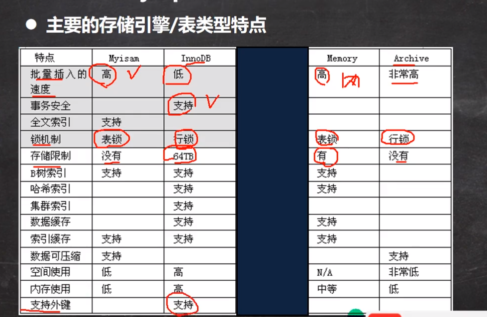
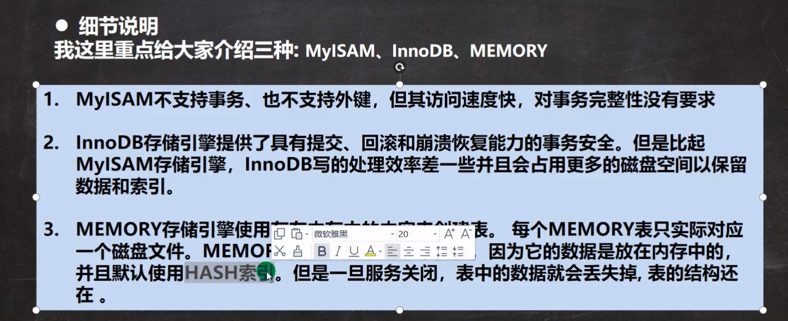

# 表类型和存储引擎

- MySQL的表类型是由存储引擎决定，主要包括MyISAM、innoDB、Memory等

- MySQL的数据表主要支持六种类型，分别是

  `CSV`,`Memory`,`ARCHIVE`,`MRG_MyISAM`,`MyISAM`,`innoDB`

- 表类型分为两种

  1. 事务安全型：`innoDB`
  2. 非事务安全型：其余所有引擎

## 重点引擎

# innoDB

- 支持事务
- 支持外键
- 支持行级锁

# MyISAM

- 不支持事务和外键
- 添加速度较快
- 支持表级锁

# Memory

- 存放在内存中
- 执行速度极快（没有IO）
- MySQL服务重启后数据会丢失（表结构还在）
- 默认支持索引
- 支持表级锁

