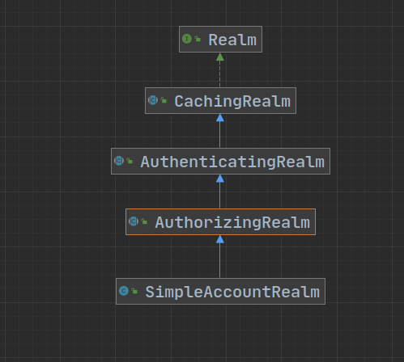
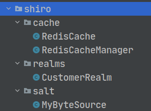

# 权限的管理


## 什么是权限管理

- 在有用户参与的系统中都需要权限管理，权限管理实现`对用户访问系统的控制`，按照安全规则或者安全策略控制用户可以访问且只能访问自己被授权的资源
- 权限管理总结起来就是`认证授权`


## Shiro核心架构


- authenticator(认证器)
- authorizer(授权器)
- Session Manager
- Session DAO : 连接数据库
- Cache Manager : 缓存管理，防止频繁访问数据库
- Pluggable Realms(可插拔域)


## Shiro认证


### 1.认证的关键对象

- Subject：主体

  指访问系统的用户、程序等

- Principal：身份信息

  是主体进行身份认证的标识，标识必须具有`唯一性`，一个用户可以有多个身份，但是必须有一个主身份

- credential：凭证信息

  只有主体自己知道的安全信息，如密码、证书等


### 2.认证流程


### Shiro认证流程源码分析

- 在`SimpleAccountRealm`类中通过`doGetAuthenticationInfo`方法执行用户名比较，完成用户校验
- 最终密码校验是在`AuthenticatingRealm `类中的`assertCredentialsMatch`方法




**总结**

​	AuthenticatingRealm  认证Realm doGetAuthenticationInfo

​	AuthorizingRealm  授权Realm doGetAuthorizationInfo


### 代码实现

#### Realm

```java
    @Override
    protected AuthenticationInfo doGetAuthenticationInfo(AuthenticationToken token) throws AuthenticationException {
        String principal = (String) token.getPrincipal();

        if ("xx".equals(principal)){
            SimpleAuthenticationInfo simpleAuthenticationInfo =
                    //参数：1.数据库的用户名 2.Md5+salt生成的密码 3.salt 4.Realm名
                    new SimpleAuthenticationInfo(principal,
                            "a9ef0a708e0ae15e1ff76c358d523a72",
                            ByteSource.Util.bytes("fd*93r"),
                            this.getName());
            return simpleAuthenticationInfo;
        }
        return null;
    }

```


#### Use

```java
        //创建安全管理器
        DefaultSecurityManager securityManager = new DefaultSecurityManager();
        //创建自定义Realm
        CustomerMd5Realm customerMd5Realm = new CustomerMd5Realm();

        //设置Realm使用的CredentialsMatcher
        HashedCredentialsMatcher hashedCredentialsMatcher = new HashedCredentialsMatcher();
        //使用的算法
        hashedCredentialsMatcher.setHashAlgorithmName("md5");
        //散列次数
        hashedCredentialsMatcher.setHashIterations(1024);
        customerMd5Realm.setCredentialsMatcher(hashedCredentialsMatcher);

        securityManager.setRealm(customerMd5Realm);
        SecurityUtils.setSecurityManager(securityManager);
        Subject subject = SecurityUtils.getSubject();
        UsernamePasswordToken token = new UsernamePasswordToken("zhangsan", "123");

        try {
            subject.login(token);
            System.out.println("success!");
        } catch (UnknownAccountException e) {
            System.out.println("username error!");
        } catch (IncorrectCredentialsException e) {
            System.out.println("password error!");
        }
```


---

## Shiro授权

### 授权

​	访问控制，控制谁能访问哪些资源。主体进行身份认证后需要分配权限方可访问系统的资源，对于某些资源没有权限是无法访问的。


### 关键对象

​	**授权可简单理解为who对what(which)进行how操作：**

- who，即主体(subject)，主体需要访问系统中的资源
- what，即资源(Resource)，资源包含`资源类型`和`资源实例`。资源类型比较笼统，资源实例比较具体
- how，权限/许可(Permission)，规定了主体对资源的操作许可，**权限离开资源没有意义**。


### 授权方式

- 基于角色的访问控制
  - RBAC(Role-Based Access Control)：以角色为中心进行访问控制
  
  ```java
  if(subject.hasRole("admin")){
      //operate resource
  }
  ```
  
  
  
- 基于资源的访问控制
  - RBAC(Resource-Based Access Control)：以资源为中心进行访问控制
  
  ```java
  if(subject.isPermission("user:update:01")){//资源实例
      //对01实例有修改权限
  }
  
  if(subject.isPermission("user:update:*")){//资源类型
  	//对该类资源有修改权限
  }
  ```


### 权限字符串

​	权限字符串的规则是：`资源标识符：操作：资源实例标识符`，`:`是分隔符，`*`表示通配符


### 代码实现

#### Realm

```java
    @Override
    protected AuthorizationInfo doGetAuthorizationInfo(PrincipalCollection principals) {

        SimpleAuthorizationInfo simpleAuthorizationInfo = new SimpleAuthorizationInfo();
        //添加角色
        simpleAuthorizationInfo.addRole("user");
        simpleAuthorizationInfo.addRole("admin");
        //添加权限（使用权限字符串）
        simpleAuthorizationInfo.addStringPermission("user:*");
        simpleAuthorizationInfo.addStringPermission("product:create:02");
        return simpleAuthorizationInfo;
    }

```


#### Use

```java
        /**
        *认证代码
        **/
		......

        //开始授权过程
        if (subject.isAuthenticated()){
            System.out.println(subject.hasRole("user"));
            System.out.println("==============");
            boolean[] booleans = subject.hasRoles(Arrays.asList("user", "super", "admin"));
            for (boolean b :
                    booleans) {
                System.out.println(b);
            }
            System.out.println("==============");
            System.out.println(subject.hasAllRoles((Arrays.asList("user"))));
            System.out.println("==============");
            System.out.println(subject.isPermitted("user:create"));
        }
```


## Shiro与SpringBoot整合

### 整合思路


1. 创建SpringBoot应用，确定受限资源和公共资源
2. 配置`ShiroFiller`，拦截所有请求
3. 对拦截的请求调用上述认证、授权API进行处理


### 常见过滤器

注意: shiro提供和多个默认的过滤器，我们可以用这些过滤器来配置控制指定url的权限：

<table><thead><tr><th>配置缩写</th><th>对应的过滤器</th><th>功能</th></tr></thead><tbody><tr><td><strong>anon</strong></td><td>AnonymousFilter</td><td>指定url可以匿名访问（访问时不需要认证授权）</td></tr><tr><td><strong>authc</strong></td><td>FormAuthenticationFilter</td><td>指定url需要<strong>form表单</strong>登录，默认会从请求中获取<code style="user-select: auto;" onclick="mdcp.copyCode(event)">username</code>、<code style="user-select: auto;" onclick="mdcp.copyCode(event)">password</code>,<code style="user-select: auto;" onclick="mdcp.copyCode(event)">rememberMe</code>等参数并尝试登录，如果登录不了就会跳转到loginUrl配置的路径。我们也可以用这个过滤器做默认的登录逻辑，但是一般都是我们自己在控制器写登录逻辑的，自己写的话出错返回的信息都可以定制嘛。</td></tr><tr><td>authcBasic</td><td>BasicHttpAuthenticationFilter</td><td>指定url需要basic登录</td></tr><tr><td>logout</td><td>LogoutFilter</td><td>登出过滤器，配置指定url就可以实现退出功能，非常方便</td></tr><tr><td>noSessionCreation</td><td>NoSessionCreationFilter</td><td>禁止创建会话</td></tr><tr><td>perms</td><td>PermissionsAuthorizationFilter</td><td>需要指定权限才能访问</td></tr><tr><td>port</td><td>PortFilter</td><td>需要指定端口才能访问</td></tr><tr><td>rest</td><td>HttpMethodPermissionFilter</td><td>将http请求方法转化成相应的动词来构造一个权限字符串，这个感觉意义不大，有兴趣自己看源码的注释</td></tr><tr><td>roles</td><td>RolesAuthorizationFilter</td><td>需要指定角色才能访问</td></tr><tr><td>ssl</td><td>SslFilter</td><td>需要https请求才能访问</td></tr><tr><td>user</td><td>UserFilter</td><td>需要已登录或“记住我”的用户才能访问</td></tr></tbody></table>


### 代码实现

```java
    @RequestMapping("save")
//    @RequiresRoles("admin") //根据用户角色进行授权 传入一个字符串数组代表需要同时具有的角色
    @RequiresPermissions("order:save:*") //根据权限进行授权
    public String save(){

        System.out.println("进入方法");

        //根据用户角色授权
//        Subject subject = SecurityUtils.getSubject();
//        if (subject.hasRole("admin")) {
//            System.out.println("保存成功！");
//        }else {
//            System.out.println("保存失败！");
//        }

//        //根据权限授权
//        Subject subject = SecurityUtils.getSubject();
//        if (subject.isPermitted("order:save:")) {
//
//            System.out.println("保存成功！");
//        }else {
//
//            System.out.println("保存失败！");
//        }
        return "redirect:/index.jsp";
    }
}
```


## Shiro权限数据库设计

1. 用户 --> 角色 --> 权限 --> 资源
2. 用户 --> 角色
3. 用户 --> 权限


## Shiro连接数据库

### 实现授权

```java
    @Override
    protected AuthorizationInfo doGetAuthorizationInfo(PrincipalCollection principals) {
        String  primaryPrincipal = (String) principals.getPrimaryPrincipal();
        //根据Bean名调用自定义工具类获取service
        UserService userService = (UserService) ApplicationContextUtils.getBean("userService");
        //根据用户名查询角色
        User user = userService.findRolesByUsername(primaryPrincipal);
        if (!CollectionUtils.isEmpty(user.getRoles())){
            SimpleAuthorizationInfo simpleAuthorizationInfo = new SimpleAuthorizationInfo();
            user.getRoles().forEach(role->{
                //添加查询到的所有角色
                simpleAuthorizationInfo.addRole(role.getName());

                //根据角色id查询权限
                Role roleAndPerms = userService.findPermsByRoleId(role.getId());
                if (!CollectionUtils.isEmpty(roleAndPerms.getPermsList())){
                    roleAndPerms.getPermsList().forEach(perms -> {
                        //添加查询到的权限
                        simpleAuthorizationInfo.addStringPermission(perms.getName());
                    });
                }
            });
            return simpleAuthorizationInfo;
        }
        return null;
    }
```


## Shiro缓存

### 集成ehcache

1. 引入依赖

   ```xml
           <dependency>
               <groupId>org.apache.shiro</groupId>
               <artifactId>shiro-ehcache</artifactId>
               <version>1.8.0</version>
           </dependency>
   ```

2. 在创建Realm时开启缓存

   ```java
           //开启缓存
           customerRealm.setCacheManager(new EhCacheManager());
           customerRealm.setCachingEnabled(true);
           customerRealm.setAuthenticationCachingEnabled(true);
           customerRealm.setAuthenticationCacheName("authenticationCache");
           customerRealm.setAuthorizationCachingEnabled(true);
           customerRealm.setAuthorizationCacheName("authorizationCache");
   ```


### 集成Redis

1. 引入依赖

   ```xml
   <dependency>
       <groupId>org.springframework.boot</groupId
       <artifactId>spring-boot-starter-data-redis</artifactId>
   </dependency>
   ```

2. 在创建Realm时开启缓存

   ```java
           //开启缓存
           customerRealm.setCacheManager(new EhCacheManager());
           customerRealm.setCachingEnabled(true);
           customerRealm.setAuthenticationCachingEnabled(true);
           customerRealm.setAuthenticationCacheName("authenticationCache");
           customerRealm.setAuthorizationCachingEnabled(true);
           customerRealm.setAuthorizationCacheName("authorizationCache");
   ```

3. 配置cacheManager

   ```java
   public class RedisCacheManager implements CacheManager {
   
       //参数1为认证或授权cache名
       @Override
       public <K, V> Cache<K, V> getCache(String cacheName) throws CacheException {
           System.out.println(cacheName);
           return new RedisCache<K, V>(cacheName);
       }
   }
   ```

   ```java
   public class RedisCache<k,v> implements Cache<k,v> {
   
       private String cacheName;
   
       //用于Redis中hash的key
       public RedisCache(String cacheName){
           this.cacheName = cacheName;
       }
   
       public RedisCache(){
   
       }
   
       @Override
       public v get(k k) throws CacheException {
           System.err.println("get key:"+k);
           return (v) getRedisTemplate().opsForHash().get(this.cacheName,k.toString());
       }
   
       @Override
       public v put(k k, v v) throws CacheException {
           System.err.println("put key:"+k);
           System.err.println("put value:"+v);
           getRedisTemplate().opsForHash().put(this.cacheName,k.toString(),v);
           return null;
       }
   
       @Override
       public v remove(k k) throws CacheException {
           return (v) getRedisTemplate().opsForHash().delete(this.cacheName,k.toString());
       }
   
       @Override
       public void clear() throws CacheException {
           getRedisTemplate().opsForHash().delete(this.cacheName);
       }
   
       @Override
       public int size() {
           return getRedisTemplate().opsForHash().size(this.cacheName).intValue();
       }
   
       @Override
       public Set<k> keys() {
           return getRedisTemplate().opsForHash().keys(this.cacheName);
       }
   
       @Override
       public Collection<v> values() {
           return getRedisTemplate().opsForHash().values(this.cacheName);
       }
   
       private RedisTemplate getRedisTemplate(){
           RedisTemplate redisTemplate = (RedisTemplate) ApplicationContextUtils.getBean("redisTemplate");
           redisTemplate.setKeySerializer(new StringRedisSerializer());
           redisTemplate.setHashKeySerializer(new StringRedisSerializer());
           return redisTemplate;
       }
   }
   ```

4. 如果使用salt处理密码的话，必须自己重写ByteSource，实现Serializable接口，并添加一个无参构造方法（否则会有无法序列化的问题）

   ```java
   public class MyByteSource implements ByteSource,Serializable {
   
   
       private byte[] bytes;
       private String cachedHex;
       private String cachedBase64;
   
       public MyByteSource(){
   
       }
       ......(照搬SimpleByteSource)
   }
   ```

   在自定义Realm中使用自己重写的MyByteSource

   ```java
   if (!ObjectUtils.isEmpty(user)){
               SimpleAuthenticationInfo simpleAuthenticationInfo =
                       new SimpleAuthenticationInfo(user.getUsername(), user.getPassword(),
                               new MyByteSource(user.getSalt()), this.getName());
               return simpleAuthenticationInfo;
           }
   ```




## Thymeleaf使用Shiro

1. 在ShiroConfig中加入方言处理

   ```java
   @Bean(name = "shiroDialect")
       public ShiroDialect shiroDialect(){
           return new ShiroDialect();
       }
   ```

   

2. 修改控制器

3. 修改html页面


### Thymeleaf中的Shiro标签

1. 引入扩展依赖

   ```xml
   <dependency>
       <groupId>com.github.theborakompanioni</groupId>
       <artifactId>thymeleaf-extras-shiro</artifactId>
       <version>2.0.0</version>
   </dependency>
   ```

2. 页面中引入命名空间

   xmlns:shiro=“http://www.pollix.at/thymeleaf/shiro”

3. 常见权限控制标签使用

   ```html
   <!-- 验证当前用户是否为“访客”，即未认证（包含未记住）的用户。 -->
   <p shiro:guest="">Please <a href="login.html">login</a></p>
   
   
   <!-- 认证通过或已记住的用户。 -->
   <p shiro:user="">
       Welcome back John! Not John? Click <a href="login.html">here</a> to login.
   </p>
   
   <!-- 已认证通过的用户。不包含已记住的用户，这是与user标签的区别所在。 -->
   <p shiro:authenticated="">
       Hello, <span shiro:principal=""></span>, how are you today?
   </p>
   <a shiro:authenticated="" href="updateAccount.html">Update your contact information</a>
   
   <!-- 输出当前用户信息，通常为登录帐号信息。 -->
   <p>Hello, <shiro:principal/>, how are you today?</p>
   
   
   <!-- 未认证通过用户，与authenticated标签相对应。与guest标签的区别是，该标签包含已记住用户。 -->
   <p shiro:notAuthenticated="">
       Please <a href="login.html">login</a> in order to update your credit card information.
   </p>
   
   <!-- 验证当前用户是否属于该角色。 -->
   <a shiro:hasRole="admin" href="admin.html">Administer the system</a><!-- 拥有该角色 -->
   
   <!-- 与hasRole标签逻辑相反，当用户不属于该角色时验证通过。 -->
   <p shiro:lacksRole="developer"><!-- 没有该角色 -->
       Sorry, you are not allowed to developer the system.
   </p>
   
   <!-- 验证当前用户是否属于以下所有角色。 -->
   <p shiro:hasAllRoles="developer, 2"><!-- 角色与判断 -->
       You are a developer and a admin.
   </p>
   
   <!-- 验证当前用户是否属于以下任意一个角色。  -->
   <p shiro:hasAnyRoles="admin, vip, developer,1"><!-- 角色或判断 -->
       You are a admin, vip, or developer.
   </p>
   
   <!--验证当前用户是否拥有指定权限。  -->
   <a shiro:hasPermission="userInfo:add" href="createUser.html">添加用户</a><!-- 拥有权限 -->
   
   <!-- 与hasPermission标签逻辑相反，当前用户没有制定权限时，验证通过。 -->
   <p shiro:lacksPermission="userInfo:del"><!-- 没有权限 -->
       Sorry, you are not allowed to delete user accounts.
   </p>
   
   <!-- 验证当前用户是否拥有以下所有角色。 -->
   <p shiro:hasAllPermissions="userInfo:view, userInfo:add"><!-- 权限与判断 -->
       You can see or add users.
   </p>
   
   <!-- 验证当前用户是否拥有以下任意一个权限。  -->
   <p shiro:hasAnyPermissions="userInfo:view, userInfo:del"><!-- 权限或判断 -->
       You can see or delete users.
   </p>
   <a shiro:hasPermission="pp" href="createUser.html">Create a new User</a>
   ```

   
